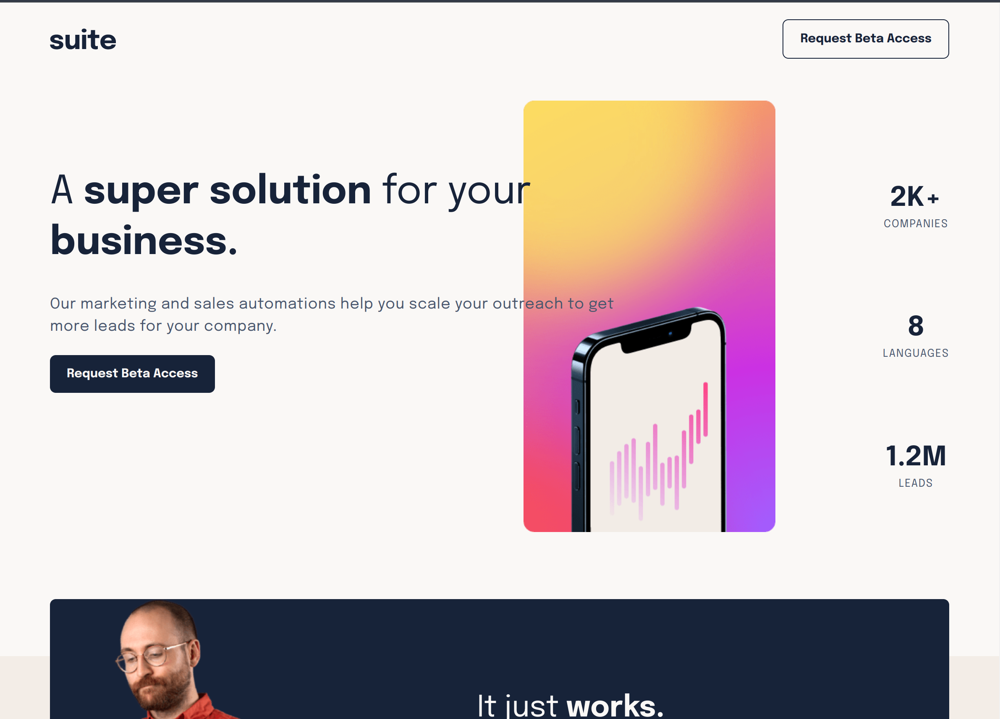
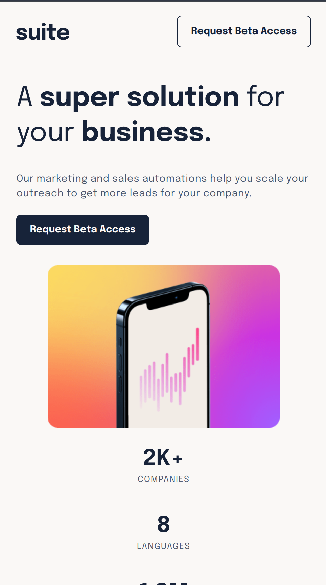

# Frontend Mentor - Suite landing page solution

This is a solution to the [Suite landing page challenge on Frontend Mentor](https://www.frontendmentor.io/challenges/suite-landing-page-tj_eaU-Ra). Frontend Mentor challenges help you improve your coding skills by building realistic projects.

## Table of contents

-   [Overview](#overview)
    -   [The challenge](#the-challenge)
    -   [Screenshot](#screenshot)
    -   [Links](#links)
-   [My process](#my-process)
    -   [Built with](#built-with)
    -   [What I learned](#what-i-learned)
    -   [Continued development](#continued-development)
    -   [Useful resources](#useful-resources)
-   [Author](#author)
-   [Acknowledgments](#acknowledgments)

## Overview

### The challenge

Users should be able to:

-   View the optimal layout depending on their device's screen size
-   See hover states for interactive elements

### Screenshot

### Links

-   Solution URL: [https://www.frontendmentor.io/solutions/suite-landing-page-3AE1oOGTr9](https://www.frontendmentor.io/solutions/suite-landing-page-3AE1oOGTr9)
-   Live Site URL: [https://verdant-lamington-24ed7c.netlify.app](https://verdant-lamington-24ed7c.netlify.app)

## My process

### Built with

-   Semantic HTML5 markup
-   CSS custom properties
-   Flexbox
-   CSS Grid
-   Mobile-first workflow

## Author

-   Website - [Yash Pathik](https://www.your-site.com)
-   Frontend Mentor - [@yashk71097](https://www.frontendmentor.io/profile/yashk71097)
